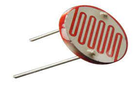
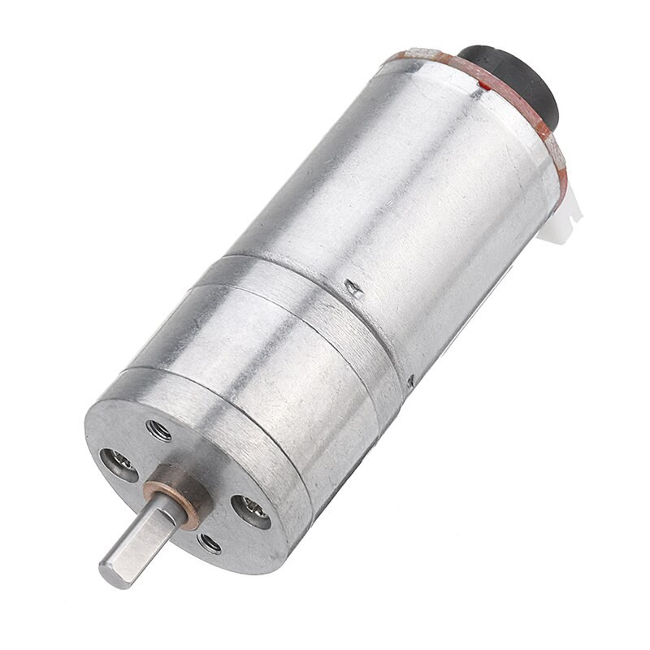
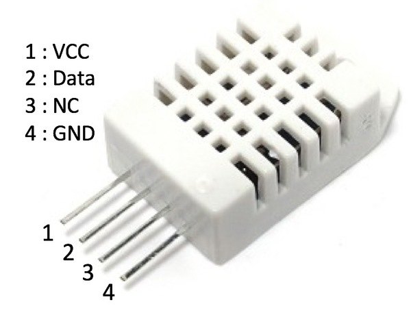
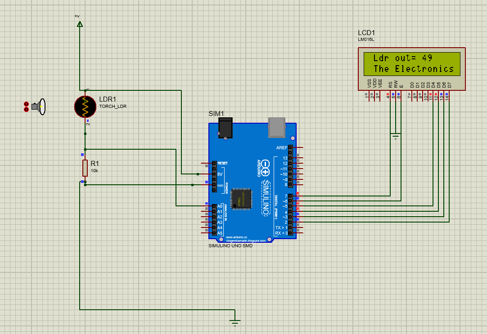
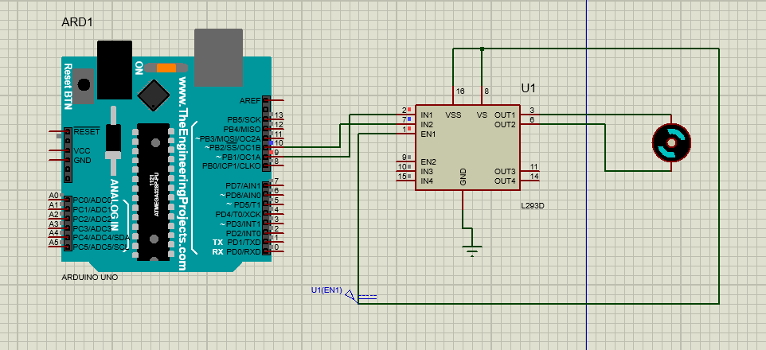
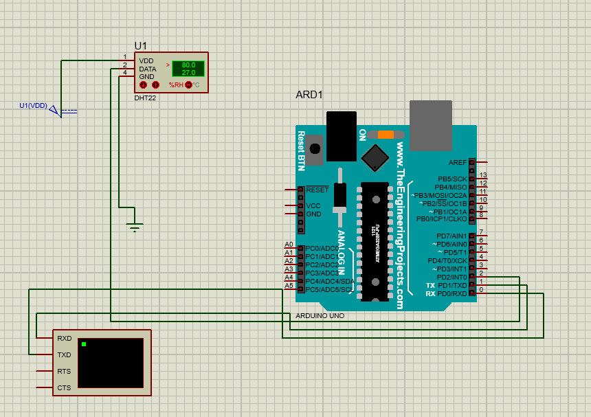

# InstrumentationProject-1402-02
IOT-based Home Automation System (With An Emphasis On Inhabitants' Wellbeing)

 <b> Course Project - Spring 2023    Contributors : R.S.Benny , M.Azimi , S.Ahmadian </b>

## Phase (Chapter) I
In this part , We have accumulated ideas and analysed some successful IOT products to help the Coherence of our project.

We First Started by getting to know IOT :

The Internet of things (IoT) describes physical objects (or groups of such objects) with sen-sors, processing ability, software and other technologies that connect and exchange data with other devices and systems over the Internet or other communications networks. Internet of things has been considered a misnomer because devices do not need to be connected to the public inter-net, they only need to be connected to a network, and be individually addressable.
The field has evolved due to the convergence of multiple technologies, including ubiquitous com-puting, commodity sensors, increasingly powerful embedded systems, as well as machine learn-ing. Traditional fields of embedded systems, wireless sensor networks, control systems, automa-tion (including home and building automation), independently and collectively enable the Internet of things 

(--Please see course report in Files uploaded in this repository--) 

Then we accumulated more data about our sensors :

- PhotoCells : A photoresistor (also known as a photocell, or light-dependent resistor, LDR, or photo-conductive cell) is a passive component that decreases resistance with respect to receiving luminosity (light) on the component's sensitive surface. The resistance of a photoresistor decreases with increase in incident light intensity; in other words, it exhibits photoconductivity. A photoresistor can be applied in light-sensitive detector circuits and light-activated and dark-activated switching circuits acting as a resistance semiconductor.

- Encoder : Position encoders are used to track the rotary position of a shaft or linear position of a load either indirectly with a motor mounted rotary encoder or directly with linear encoders.

- DHT22 : These sensors have been designed for various applications to measure the humidity as well as the temperature of the environment. They do so by finding the amount of water vapor present in the air around the sensors. The amount of moisture in the gas can be a mixture of different elements including nitrogen, water vapor, argon, etc. Since humidity can have huge effects on different biological, chemical, and physical processes, it should be measured and controlled in different industries and hence, there’s a need for these sensors to help us out.

## Phase (Chapter) II
In this Phase we have simulated our ideas Inside proteus , We have implemented Kalman Filter (Estimation , Noise Rejection) too !!
- Photocells :

(--Please see course report in Files uploaded in this repository--) 
- Encoder :

(--Please see course report in Files uploaded in this repository--) 
- DHT22 :

(--Please see course report in Files uploaded in this repository--) 
- Kalman Filter :

(--Please see course report in Files uploaded in this repository--) 

## Phase (Chapter) III
In this Phase We have implemented some practical Aspects of the Project 

(--Please see course report in Files uploaded in this repository--) 
