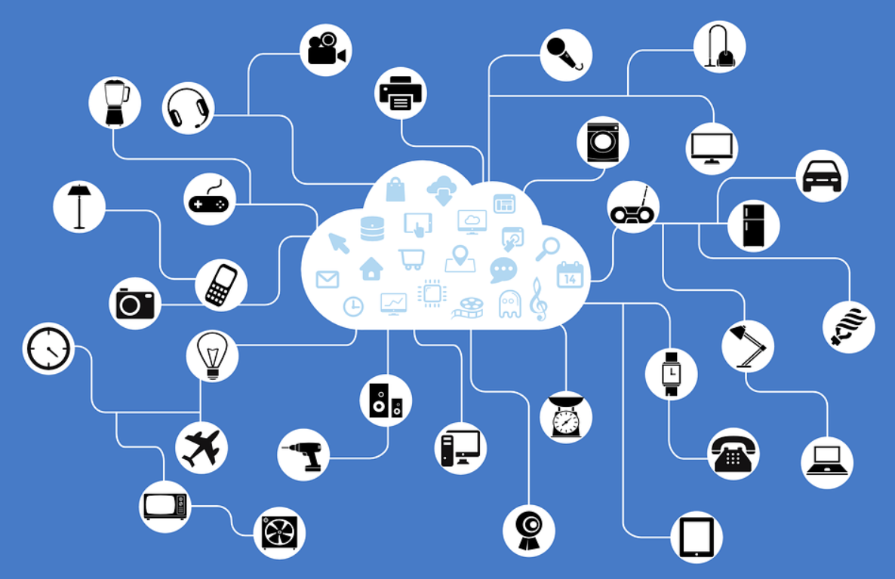

# InstrumentationProject-1402-02
IOT-based Home Automation System (With An Emphasis On Inhabitants' Wellbeing)

 <b> Course Project - Spring 2023    Contributors : R.S.Benny , M.Azimi , S.Ahmadian </b>

## Phase (Chapter) I
In this part , We have accumulated ideas and analysed some successful IOT products to help the Coherence of our project.
We First Started by getting to know IOT :

The Internet of things (IoT) describes physical objects (or groups of such objects) with sen-sors, processing ability, software and other technologies that connect and exchange data with other devices and systems over the Internet or other communications networks. Internet of things has been considered a misnomer because devices do not need to be connected to the public inter-net, they only need to be connected to a network, and be individually addressable.
The field has evolved due to the convergence of multiple technologies, including ubiquitous com-puting, commodity sensors, increasingly powerful embedded systems, as well as machine learn-ing. Traditional fields of embedded systems, wireless sensor networks, control systems, automa-tion (including home and building automation), independently and collectively enable the Internet of things

## Phase (Chapter) II

## Phase (Chapter) III
